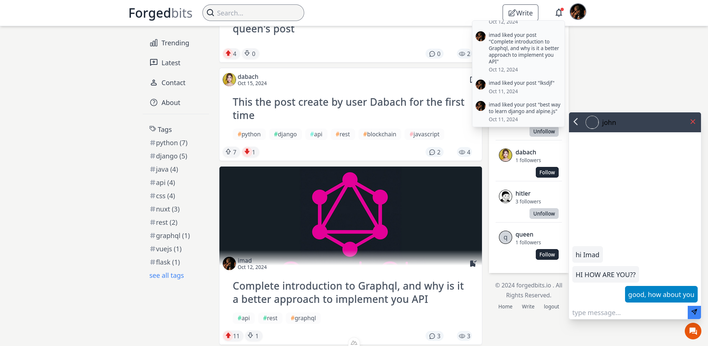

## Screenshot



## Getting Started

Follow these instructions to get a copy of the project up and running on your local machine for development and testing purposes.

### Prerequisites

- Docker and Docker Compose
- Python (for the backend)
- Node.js and npm (for the frontend)

### Installation & Running

    ```bash
    docker compose up

    cd backend
    pip install -r requirements.txt
    python run.py

    cd frontend
    npm install
    npm run dev
    ```
